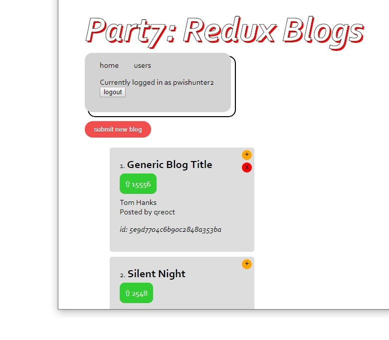

# fullstackopen20

My course submissions for the exercises for [Fullstackopen 2020](https://fullstackopen.com/en/about), an online course by the University of Helsinki as an 'introduction to modern web application development with JavaScript'.

I learnt about React and how to write a Node server with Express and a REST API to communicate with each other. There was also a bit about GraphQL as an alternative to REST APIs too.

Pretty good course! I really enjoyed it, and recommend it if you want to learn fullstack development with the MERN stack.

*Screenshot of part 7 exercise: an application with user login, redux, and simple POST actions*

## Running the code

Clone the directories that you like, and run `npm install` to get the relevant node-modules/dependencies, and then `npm start`.

Most of the parts have a `notes.md` file for some key bugs that I fought and how I dealt with them, as well as key learning points.
